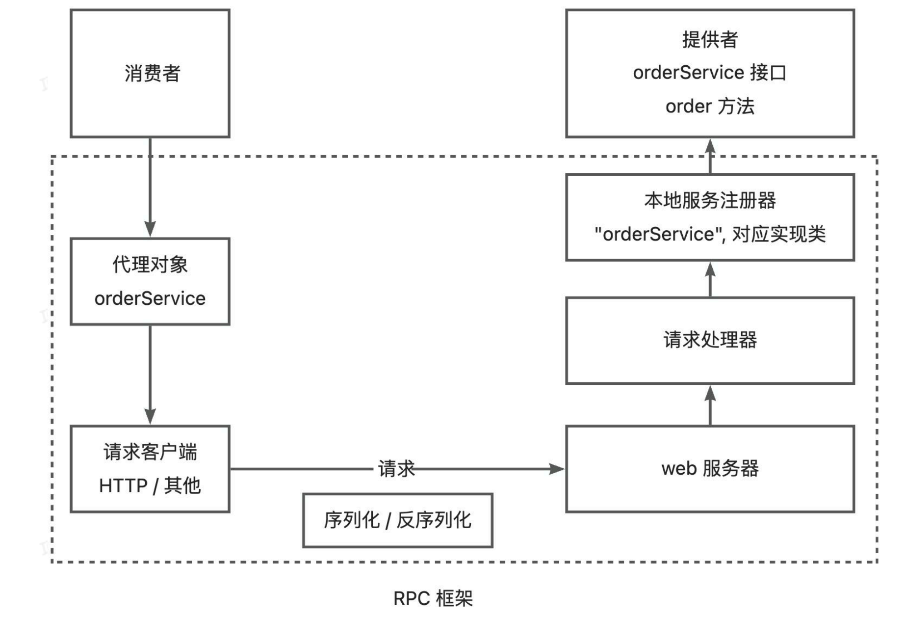

# 简易版rpc的业务具体流程
> rpc项目整体上分为三部分:
> 1. 服务提供者: 负责提供接口方法的实现(提供者相对于服务器端，需要实现处理消费者端发过来的请求)
> 2. 服务消费者: 负责调用服务提供者实现的方法(消费者需要向服务提供者发送请求)
> 3. RPC框架: 负责将服务提供者与服务消费者进行通信，并实现服务调用
> - 实现上述部分需要以下准备
>   - 需要实现序列化接口，便于网络传输数据
>   - 需要实现提供者端的请求处理器，可以根据发送过来的请求实现服务调用
>   - 需要实现消费者端的请求封装，可以根据动态代理模式实现不同接口的请求发送
>   
## 项目准备
### 需求分析
1. 服务提供者模块: 服务模块需要实现接口，并实现相关方法，同时需要实现实现类注册，可以根据接口名找到实现类
2. 服务消费者模块: 消费者模块需要向服务提供者发送请求，并获得结果
3. RPC模块: 
    - 序列化接口实现，便于扩展不同的序列化方式
    - 局部注册仓库实现，可以让服务提供者注册实现类
    - 动态代理实现，可以根据动态代理模式实现不同接口的请求发送
    - 请求处理器实现，根据请求信息，找到服务提供者对应的实现类并调用方法，并返回结果
### 技术选型
- 局部注册仓库：先用ConcurrentHashMap类实现，可以动态的增删服务提供者，并且线程安全，采用数组 + 链表 + 红黑树的数据结构， 
当链表长度超过一定阈值（默认为 8）且数组长度大于 64 时，链表会转换为红黑树，以提高查找效率；当红黑树节点数小于等于 6 时，会转换回链表。
java8前采用分段锁，java8及之后就是cas+synchronized，所以线程安全
- 服务器: Etcd 官方文档：https://etcd.io/docs/
  - **简单易用**：Vert.x提供了高层次的抽象，相比Netty框架更简单易用。它不仅仅是一个网络框架，还是一个完整的异步编程框架，提供了包括HTTP服务器/客户端、WebSocket、事件总线、数据库访问、定时器等在内的多种构建高性能应用程序的工具和各种网络编程的API。
  - **高性能**：Vert.x基于事件循环机制，采用单线程或少量线程处理大量并发连接，可以有效减少线程上下文切换的开销，提高服务器的吞吐量和响应速度。更适合RPC框架这种需要处理大量TCP连接的应用场景。
  - **解决半包粘包问题**：对于TCP半包粘包的情况，Vert.x提供了RecordParser类，能更方便地解决，不用自己去设计算法来处理。
- java
- Hutool: https://doc.hutool.cn/pages/index/
## 项目实施
### 初始化阶段
1. 创建maven项目
2. 创建几个模块:
    - example-common：代码的公共依赖，包括接口、Model 等
    - example-consumer：服务消费者模块
    - example-provider：服务提供者模块
    - rpc-easy：简易版 RPC 框架模块
### example-common开发
> 负责存储服务接口和model
1. 创建一个简单的 User类和UserService接口，给其他模块用
### rpc-easy开发
1. 实现序列化接口，实现一个实现类，便于调用测试
2. 实现实现类本地注册，采用conCurrentHashMap方法实现，key为类全限定名，value为实现类，提供对应的register，get，remove方法
2. 实现请求处理器，先设置通用的处理器接口，再实现基于vert.x的请求处理器
4. 实现动态代理，用于生成代理类
### example-provider开发
1. 实现UserService接口，并实现相关方法
2. 将方法存到本地服务注册
3. 实现启动类，结合Vert.x服务器开启端口监听
### example-consumer开发
> 负责调用example-provider中实现的服务
1. 使用动态代理技术得到代理类，调用方法